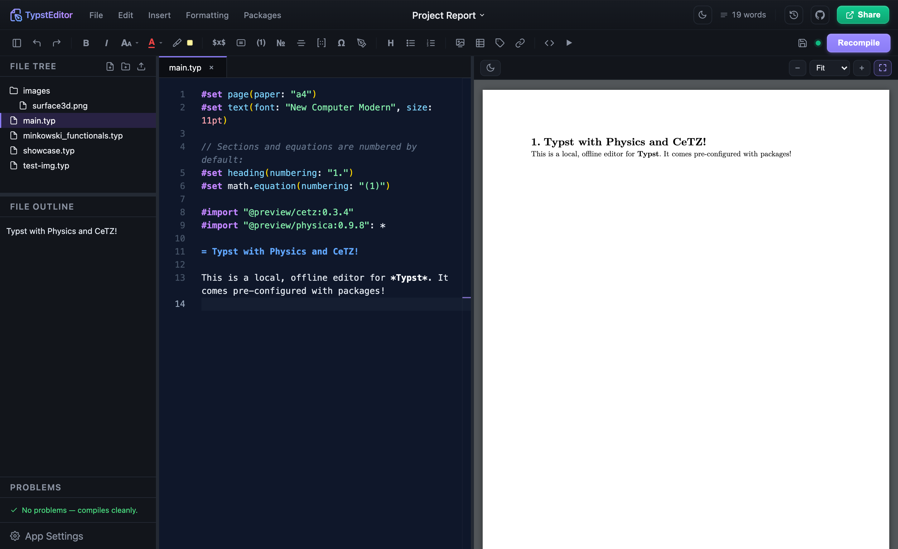
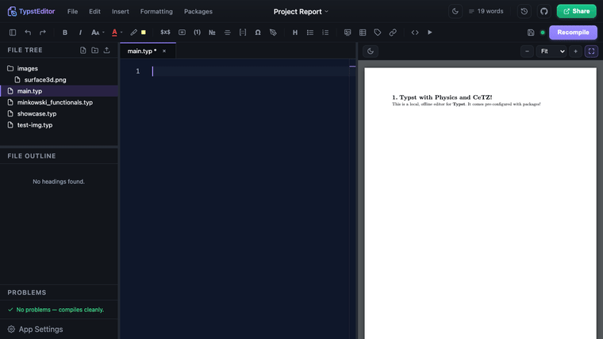

# Typst Editor

A local, offline desktop-style editor for [Typst](https://typst.app), built for
maths/physics writing. It pairs a Monaco code editor with a live PDF preview and adds
batteries-included inserts for equations, figures, plots, tables and references — plus
**live execution of Python, Julia and Wolfram code** whose text or plot output can be
dropped straight into the document.



## Demo

Live editing with an instant PDF preview:



Run Python/Julia/Wolfram and drop the result in as a typeset equation:


> Everything runs on your machine. A tiny local Node server drives the Typst compiler
> and (optional) code execution; nothing is sent to the cloud unless you explicitly use
> Google Drive sync.

## Features

- **Live PDF preview** with auto-recompile, **zoom / fit-to-width**, and **double-click a
  word to jump to it in the source**.
- **Editor**: Typst syntax highlighting + theme, completions, `@`-cross-reference
  autocomplete, word count, file tree (create files & **folders**, **upload images**),
  outline, a clickable **Problems** panel, alignment shortcuts, and resizable panes.
- **Insert menu** (grouped submenus): title block / author / institute / abstract,
  headings, inline / block / aligned / numbered equations, matrices, a math & physics
  symbol picker (`physica`), bullet & numbered lists, figures, images, tables, 2D/3D
  plots, code blocks, links, cross-references and labels — most with a **center on page**
  option.
- **Numbering** on by default; toggle it on the heading/equation under the cursor with
  **⌘⇧N**.
- **Plots**: 2D via `cetz` + `cetz-plot`, 3D surfaces via `cetz` (pure Typst) or
  Python/matplotlib.
- **Run code → insert result** (Insert → Compute): Python, Julia or Wolfram. Insert the
  text output, a generated figure, or — in **Equation mode** — write plain maths (e.g.
  `D[Sin[x^2], x]`) and get a **typeset equation** automatically (LaTeX via `mitex`).
- **Templates** from Typst Universe with a **rendered preview**.
- **Import data** (CSV / JSON / YAML / TOML) — Insert → Import Data drops the file in and
  wires up the matching Typst reader.
- **Git** (init / commit / push to GitHub) and **Save / Open / Export** to PDF, **HTML**,
  `.typ`, a local folder, **Google Drive**, or **WebDAV** (Nextcloud / ownCloud).

## Requirements

- **Node.js 18+**
- **[Typst CLI](https://github.com/typst/typst)** on your `PATH`
  (`brew install typst`, `cargo install typst-cli`, or a release binary).
- Optional, for live execution:
  - **Python 3** with `numpy`, `matplotlib`, `sympy`
  - **Julia** (`Latexify` for equation mode)
  - **WolframScript**

## Install & run

```bash
git clone https://github.com/aburousan/typsteditor.git
cd typsteditor
bash scripts/setup.sh   # installs Typst + Python deps and runs npm install (macOS/Linux)
npm run dev
```

`scripts/setup.sh` sets up everything you need (Typst CLI, the Python stack, npm
deps). If you already have the tools, just `npm install && npm run dev`.

### Docker (easiest — bundles Typst + Python)

```bash
docker build -t typst-editor .
docker run --rm -p 127.0.0.1:3001:3001 -v "$PWD/workspace:/app/workspace" typst-editor
# open http://localhost:3001
```

The image ships the **Typst CLI** and a **Python** stack (numpy/matplotlib/sympy), so
nothing else is needed. Your documents persist in the mounted `workspace/` folder.
Publish the port to `127.0.0.1` only (as above) — the code-execution feature runs code
inside the container.

`npm run dev` starts both the Vite dev server and the local backend. Open the printed
URL (default <http://localhost:5173>); the backend listens on `http://127.0.0.1:3001`.

To build a static front-end bundle:

```bash
npm run build      # outputs to dist/
npm run preview    # serve the build locally
```

> Note: `dist/` is only the UI. The compiler/execution features need the backend, so run
> `node server.js` alongside any static deployment (and keep it on localhost). The backend
> also serves `dist/`, so `node server.js` alone opens the full app at
> <http://127.0.0.1:3001>.

### Desktop app (macOS / Linux)

There's an [Electron](https://www.electronjs.org/) shell so users can run it without a
terminal:

```bash
npm run app     # build the UI and launch the desktop window
npm run dist     # build installers (.dmg on macOS, .AppImage/.deb on Linux) via electron-builder
```

`npm run dist` produces installers in `release/`. Your documents live in
`~/Documents/TypstEditor`. The app still needs the **Typst CLI** on the system `PATH`
(and Python/Julia/Wolfram for the optional code-execution features) — those are not
bundled.

## Usage tips

- **Compile**: edits auto-recompile after a short pause; **⌘S** saves + recompiles now.
- **Numbering**: place the cursor on a heading or block equation and press **⌘⇧N**.
- **Cross-references**: add a label (`= Intro <sec:intro>`), then type `@` and pick it.
- **Run code**: Insert → Compute → choose a language. Set **Output → Equation** to turn a
  plain expression into a rendered equation; check *Include source code* to embed both.
- **Plots**: Insert → Plots → 2D / 3D (cetz) / 3D (Python).
- **Jump from PDF**: double-click a word in the preview to find it in the editor.

## Configuration (env vars)

| Variable | Default | Purpose |
| --- | --- | --- |
| `ALLOW_CODE_EXECUTION` | `1` | Set to `0` to disable all code execution. |
| `EXEC_TIMEOUT_MS` | `45000` | Per-run wall-clock limit. |

Interpreters (including conda environments) are auto-detected; pick the default per
language in **App Settings → Interpreters**.

## Security model

The backend is built for **local single-user** use:

- Binds to `127.0.0.1` only; CORS limited to `localhost`/`127.0.0.1`.
- File access is confined to `workspace/` (path traversal rejected).
- Code execution is **opt-outable** (`ALLOW_CODE_EXECUTION=0`), time-limited, runs in
  `workspace/sandbox/`, and is **screened** for process/network/shell/destructive calls.

These are guardrails, **not** a hardened sandbox: code still runs with your user
privileges and the denylist is heuristic. **Do not expose port 3001 to a network or run
untrusted documents.** For multi-user or untrusted use you'd need real OS-level isolation
(containers/VM).

To use **Google Drive sync** you must create your own OAuth Client ID (Google Cloud
Console → Credentials → OAuth client, *Web application*, authorized origin
`http://localhost:5173`) and paste it into App Settings → Cloud Accounts.

## License

MIT — see [LICENSE](LICENSE).
