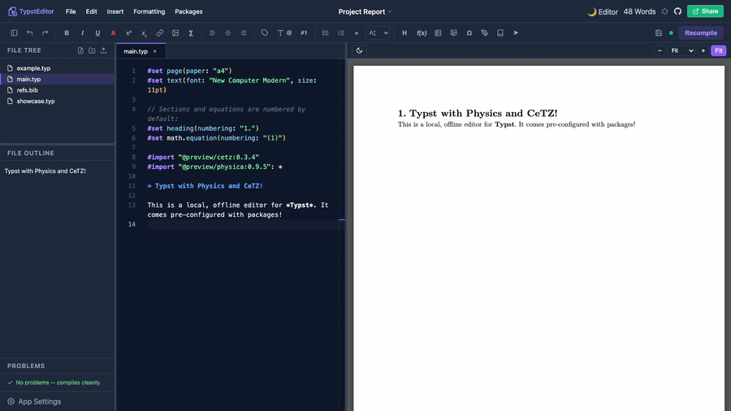
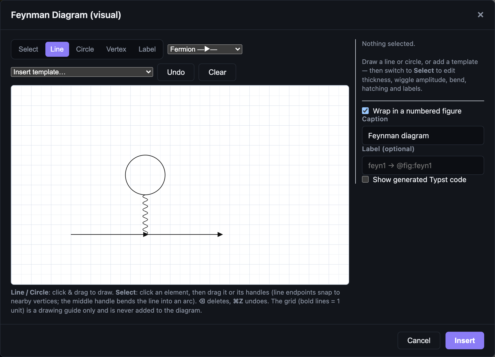
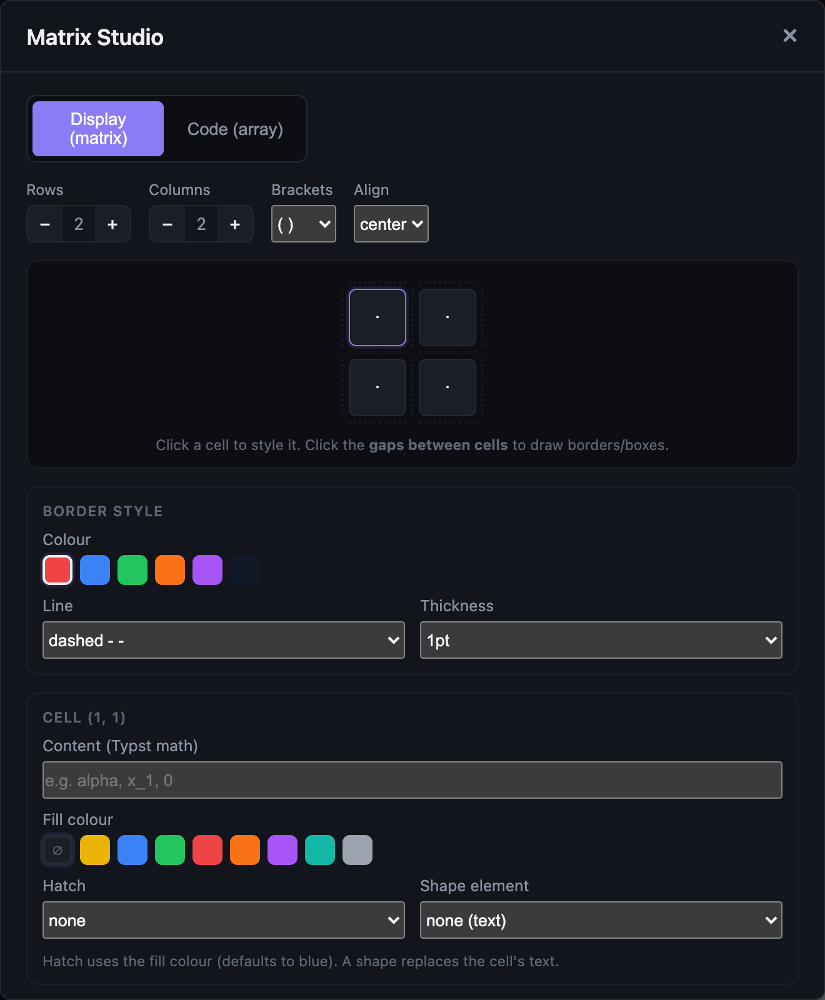
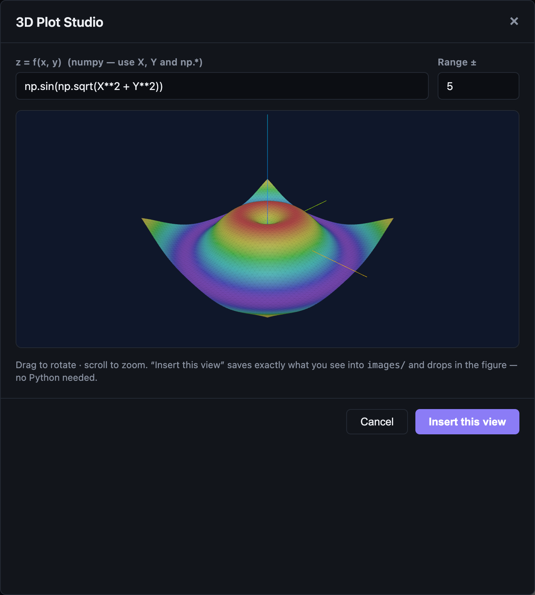
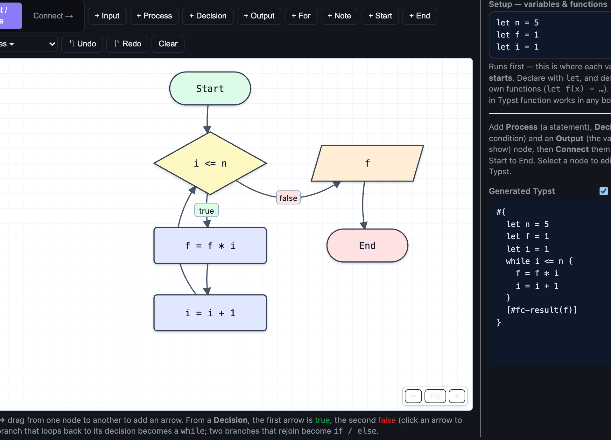

# Hilbert: an unofficial scientific-writing IDE for Typst

> **Unofficial.** Hilbert is an independent, community-built application. It is not
> the Typst web app, IDE, or compiler, and is not affiliated with or endorsed by
> the Typst team. "Typst" is a trademark of its respective owners; this project
> merely builds on top of the open-source Typst compiler.

> **Website:** [rousan.netlify.app/hilbert](https://rousan.netlify.app/hilbert/). The
> landing page has a feature overview and download links.

> **Automatic updates:** Hilbert updates itself. Install it once and every future
> version arrives on its own (it asks before installing). Grab it from the
> [latest release](https://github.com/aburousan/hilbert-editor/releases/latest)
> (currently 0.1.10). On Linux the AppImage auto-updates; the `.deb` does not.
> [What changed in each version](docs/RELEASE_NOTES.md).

It started as "an offline, Overleaf-feeling place to write physics and maths," and
grew into a full scientific-writing IDE: a real code editor on the left, a live PDF
on the right. Equations, matrices, plots, diagrams, theorems, citations, and running
code are a click away instead of something you memorise. It runs entirely on your
machine, works offline, and can execute your Python, Julia, or Wolfram snippets and
drop the result straight into the document.


---

## Contents

- [What it's like to use](#what-its-like-to-use)
- [Feature tour (with demos)](#feature-tour)
- [Everything in the box](#everything-in-the-box): the full list
- [What you need](#what-you-need)
- [Get it (downloads & install)](#get-it)
- [Run from source](#run-from-source)
- [Tips](#a-few-tips) · [Troubleshooting](#troubleshooting) · [Configuration](#configuration) · [Security](#security-model)
- [What's next](#whats-next)

---

## What it's like to use

The PDF re-renders as you type. The editor is Monaco, the same one VS Code runs on,
with Typst hover-docs and autocomplete. It opens and is usable in well under a second.

Most of the syntax you'd otherwise have to memorise is a click away: equations,
matrices, tables, figures, theorem boxes, citations by DOI or arXiv, 2D and 3D plots,
commutative and Feynman diagrams. Each drops in as clean, editable Typst that stays
yours. Press ⌘K and you can search every one of them by name.

It will also do the actual maths. Run a Python, Julia, or Wolfram snippet and get the
result back as a typeset equation, or highlight an expression and simplify, solve, or
integrate it where it sits.

Underneath it behaves like a real workspace. Open any folder the way you would in VS
Code, split a document across `#include`d chapters, drag files around the tree, search
the whole project at once.

It is also small. The backend idles at 12 MB and installs in 37 MB, a fraction of what
a comparable Electron editor costs, and a thousand-file project only takes it to 18 MB
([benchmarks](docs/PERFORMANCE.md)). It works offline, updates itself, and keeps
crashes contained: a broken tool shows an error rather than blanking the editor. On
Windows it never flashes a console window at you.

---

## Feature tour

A live PDF preview recompiles as you type, with zoom, fit-to-width, and a dark mode.
Double-click any word in the PDF to jump to it in the source.


Plot Studio is one tool for every plot: 2D functions (`y=f(x)`, implicit, parametric),
2D data (line, scatter, bar), and 3D surfaces, plus a one-click launch into the
interactive 3D studio and the Python/matplotlib runner. It emits `cetz` and
`cetz-plot`.


cetz Canvas lets you draw diagrams visually. Click shapes from a palette onto a live
preview, then set each one's position, size, rotation, and colour, without guessing at
coordinates.


Commutative diagrams are drawn in a bundled, offline copy of
[quiver](https://github.com/varkor/quiver), which produces editable `fletcher` code.


Write Python and Julia straight into the document and press Run Notebook. Every code
block in the file runs as one session, so variables carry from cell to cell, and the
output is written back underneath each block. The compiled PDF marks each block with
its language logo.


Run Python, Julia, or Wolfram in a scratchpad instead, and insert the result as text, a
figure, or a typeset equation.


Colour anything with a draggable colour-grid picker.



Sketch a symbol and get its Typst code.


Cite by DOI or arXiv id: Hilbert looks the paper up, saves it to `refs.bib`, and cites
it.


Browse Typst Universe templates with a rendered preview.


Toggle a dark PDF preview, like Overleaf.


### More visual builders

Feynman diagrams support fermion, photon, gluon, scalar, and ghost propagators, loops
with fermion-flow arrows, hatched or shaded blobs, vertices, and labels, all producing
editable `cetz`.



Matrix Studio is a visual grid with fills, borders, brackets, and a code-array mode.



3D Plot Studio lets you rotate a surface to the exact angle you want, then insert that
view.



Flowchart to Code: draw the logic, and it writes the `while`, `if`, and `for`.



> Everything happens on your computer. A small local server drives the Typst compiler
> and (optional) code execution. Nothing leaves the machine unless you deliberately
> turn on Google Drive or WebDAV sync.

---

## Everything in the box

The full list, grouped by what you're doing.

### Editing and preview

The Monaco editor handles Typst highlighting, and
[tinymist](https://github.com/Myriad-Dreamin/tinymist) supplies hover documentation
and autocomplete, plus live errors, warnings, information, and hints in Monaco and
the Problems panel. Hover any function for its signature and docs, and get completions
for every builtin, package export, and label. There's `@`-reference autocomplete, and
image-path autocomplete inside `image("…")`. Control-flow completions offer both the
`{ }` code body and the `[ ]` content body for `if`, `for`, and `while`. The same
engine drives code intelligence from the Edit menu and the editor's right-click menu:
go to definition, find references, rename a symbol across the file, quick fixes, and
whole-document formatting (F2) with the bundled typstyle formatter.

The PDF preview recompiles as you type, with zoom, fit-to-width, a dark PDF mode, and
double-click-to-source (it reads the surrounding words to land on the right
occurrence). When a compile fails you keep the last good preview and the errors move
to their own Problems tab, so a typo mid-sentence doesn't blank the page — the last
good render stays up from the moment you open a project, with a slim strip at the
bottom you click for the full error list. There's also an experimental **HTML Preview**
(View menu) that renders the document through Typst's HTML export.

Slide Studio builds editable 16:9 decks with templates, drag-and-drop positioning,
shapes, curves with optional arrowheads, equations, app-tool inserts, alignment controls, copy/paste,
undo/redo, optional grid snapping, and drag-reorderable slide thumbnails. Its layout
is stored inside ordinary Typst source, so an existing deck can be reopened and edited.

Multi-file projects compile from the project root (`main.typ`, or the `typst.toml`
entrypoint), so `#include`d chapters that share a bibliography or labels render as a
whole. The root file shows a MAIN badge; right-click any `.typ` and choose
**Set as main file** to change it.

There's also a clickable Problems panel, a File Outline, resizable panes, a ⌘K command
palette covering every menu action, a Help window listing the features, and a live
word count of the rendered document (read from the PDF, so `#set` and `#import` lines
don't inflate it). The View menu and a status bar along the bottom switch the file
tree, outline, problems, editor, and preview on and off individually — hide the editor
to read, hide the preview to write. **File → New Window** opens another project in a
second window; it's one app (a single Dock icon) with independent windows, each with
its own preview, and comment/uncomment works on the current line or selection (⌘/ or
Ctrl+/, in Typst, Python, Julia, `.bib`, and more).

### Projects and files (VS Code style)

**Open Folder** makes any folder on disk the workspace, with edits saved straight back
on the desktop app and in Chrome/Edge, plus **File → Open Recent**. The file tree does
multi-select, drag-and-drop moves, rename, duplicate, delete, cut, copy, paste, a
right-click menu, new file and folder, asset upload, compress to `.zip`, and
reveal-in-file-manager. Full-text search across the workspace jumps you to the line.
Files changed on disk by Git or another editor are picked up automatically; if you had
unsaved edits, Hilbert shows both versions side by side and lets you choose rather than
silently overwriting either one.

### Inserting the annoying stuff

Title blocks, headings, abstracts, authors, and institutes. Inline, block, aligned,
and numbered equations, with numbering on by default (toggle it under the cursor with
⌘⇧N). Matrices through the visual Matrix Studio, plus tables, figures, images, and
lists, most with a *center on page* toggle.

The Page Setup builder (Formatting → Page Setup) writes the `#set page(...)` rule for
paper size, per-side margins, header and footer, and page numbers. Text formatting
covers bold, italic, super- and subscript, a draggable colour picker, underline,
highlight, strike-through, boxed selections with fill and border and texture, a
font-size dropdown, alignment, rotation, small caps, and a full-width horizontal rule
(⌘⇧H).

Cross-references work by adding a label (`= Intro <sec:intro>`), typing `@`, and
picking it. The image editor crops and rotates PNGs and JPGs before inserting; SVGs
open as a safe preview.

### Maths and physics

A maths and physics symbol picker backed by `physica`, and a draw-a-symbol pad that
matches your sketch against the glyph shapes offline.

Theorems, proofs, and lemmas, plain or in coloured boxes, each kind numbered
separately. A Physics & Cosmology menu of ready-made, compile-checked equations:
bra-kets, commutators, the Dirac and Klein-Gordon equations, the QED Lagrangian,
Einstein's field equations, Christoffel symbols, the FRW metric, and the Friedmann
equations. An equation gallery of fill-in templates sits alongside it.

### Plots and diagrams

Plot Studio is the unified plotting tool: 2D functions (explicit, implicit,
parametric), 2D data (line, scatter, bar), 3D `cetz` surfaces, and launchers for the
interactive 3D studio and the Python/matplotlib runner.

cetz Canvas is a visual shape builder with 13 primitives (circle, ellipse, rectangle,
triangle, hexagon, line, arrow, arc, curve, grid, point, axes, label), a live preview,
and per-shape position, size, rotation, and colour. It can also plot a curve straight
from a data file once you pick the X and Y columns.

3D Plot Studio gives you a surface you rotate by hand, then insert exactly that view.
Commutative diagrams come from the bundled offline copy of
[quiver](https://github.com/varkor/quiver) as editable `fletcher`. Feynman diagrams are
drawn visually and come out as editable `cetz`. Flowchart to Code turns drawn logic
into `while`, `if`, and `for`. General 2D plotting runs through `cetz` and `cetz-plot`.

### Maths that computes

Run code and insert the result (Python, Julia, or Wolfram) as text output, a generated
figure, or, in *equation mode*, write plain maths like `diff(sin(x**2), x)` and get a
typeset equation back.

Run Notebook executes every ```` ```python ```` and ```` ```julia ```` block in the
document as one session, so variables persist between cells. Output and plots land
below each block, and the compiled PDF badges each block with its language logo.

Compute on a selection: highlight an expression and simplify, solve, differentiate,
integrate, or evaluate it with sympy, dropped back in as an equation.

The runner ships with physics examples: General Relativity with
[xAct](http://www.xact.es/) (Schwarzschild curvature through to the Ricci tensor and
the Kretschmann scalar), Penrose diagrams, and Clebsch-Gordan and Wigner 3-j
coefficients, as a rendered image or a typeset equation.

### References and bibliography

A reference and label manager lists every label and `@reference`, flagging the
undefined, duplicated, and unused ones. The citation manager looks a paper up by DOI
or arXiv id, saves it to `refs.bib`, and cites it with `@key`, adding the bibliography
section for you.

### Getting things in and out

Import data from CSV, TSV, or Excel with a preview, then insert it as a Typst table, a
plot with the columns you choose, or a variable. JSON, YAML, and TOML come in with the
matching Typst reader wired up. Import your own fonts (`.ttf` / `.otf`) via
File → Import Font.

Templates come from Typst Universe with a rendered preview, and five ship with the app
for offline use, including a two-column journal paper. Export goes to PDF (with page
ranges, PDF/A standards, tagging, and pretty-printing), PNG, SVG, HTML, plain `.typ`,
or the whole project folder, through your system's save dialog. Git support covers
init, commit, and push to GitHub. There's also sync to a local folder, Google Drive,
or WebDAV (Nextcloud and ownCloud), and a package manager to search, download, and
remove Typst packages.

Live collaboration is offline-first and account-free. From the command palette, host
the open text file on the detected campus/LAN address and share the generated
invitation, or paste an invitation to join. Hilbert starts a separate collaboration-only
listener (port 3020 when available); it never exposes the workspace API. Yjs updates,
presence, and cursors are encrypted end to end with the one-session key in the
invitation. A user-operated relay can be selected instead by setting its `ws://` or
`wss://` address. The standalone relay is:

```sh
hilbert --sync-server --port 3020
```

The host must remain online for a direct session. Everyone's ordinary project file
continues to save locally, and reconnection merges live CRDT updates while the session
is active. For step-by-step setup, including the single-router, campus, and dedicated
relay cases, see [docs/COLLABORATION.md](docs/COLLABORATION.md).

### Reliability and platform

The auto-updater (Tauri build) checks on launch and asks before installing. If the
check can't run, the app still starts normally.

Heavy tools (3D studio, Plot Studio, whiteboard, code runner) are isolated, so an
error in one shows a dismissible message instead of blanking the editor. A failed
compile keeps your last good preview. On Windows, background tools never flash a
console window. Bundled Typst packages are cached locally, so documents compile with
no network and no downloads.

---

## What you need

Hilbert drives external tools rather than reimplementing them, so a couple of things
must be on your `PATH`:

- [Typst CLI](https://github.com/typst/typst) 0.15 or newer, required for compiling.
  Install it with `brew install typst`, `winget install Typst.Typst`,
  `cargo install typst-cli`, or a release binary. Verify with `typst --version`.
- [tinymist](https://github.com/Myriad-Dreamin/tinymist), the Typst language server,
  is optional but recommended, for diagnostics, hover docs, and autocomplete.
  - macOS: `brew install tinymist`
  - Windows: `winget install Myriad-Dreamin.tinymist` (or `scoop install tinymist`)
  - Linux, or any OS with Rust: `cargo install tinymist`

  Hilbert checks `TINYMIST_BIN` first (bundled builds set it automatically), then its
  managed app-data location, and finally `PATH`. The exact path, source, version, running state, and
  restart control are shown under **App Settings → General**. Without Tinymist the
  editor still compiles and previews normally; language-server features stay quiet.
- For running code, optionally: Python 3 (with `numpy`, `matplotlib`, `sympy`), Julia
  (`Latexify` for equation mode), and WolframScript.
- Node.js 18+ and a [Rust toolchain](https://rustup.rs) (stable), only if you run
  from source — the backend is compiled by `cargo` on first run.

---

## Get it

The [landing page](https://rousan.netlify.app/hilbert/) has an overview and download
links. Prebuilt installers are on the
[Releases](https://github.com/aburousan/hilbert-editor/releases) page. The app is
small, light on memory, and auto-updates.

| Platform | Download |
| --- | --- |
| Windows | `.exe` / `.msi` |
| macOS, Apple Silicon | `…-macOS-arm64.dmg` |
| macOS, Intel | `…-macOS-x64.dmg` |
| Linux | `.AppImage` (auto-updates) / `.deb` |

On a Mac, pick Apple Silicon for M-series chips and Intel for older Macs (*About This
Mac* tells you which). The desktop app still needs the Typst CLI on your `PATH`.

> **macOS, first launch.** The app isn't notarised (there's no paid Apple developer
> account), so macOS quarantines it, and renaming or moving the `.app` can break its
> ad-hoc signature. If it won't open, or says it's *"damaged"*, run these two commands
> once:
> ```bash
> xattr -cr "/Applications/Hilbert.app"
> codesign --force --deep --sign - "/Applications/Hilbert.app"
> ```
> **Run these as two separate commands, one per line.** If you paste them joined onto
> a single line, the shell reads `--force` as an option to `xattr` and reports it as
> unrecognised. Enter the first line, press return, then the second. (Adjust the path
> if the app is elsewhere, e.g. `~/Downloads`.) The code is open, so you can audit or
> build it yourself. This is a one-time step.

### Windows

Download the `.exe` (or `.msi`) from Releases and run it. It behaves like a normal
Windows app: launching tools never flashes a console window, and a failed compile
shows an error panel instead of closing. You still need the Typst CLI on `PATH`.

---

## Run from source

Everything lives in this one repository: the React/Monaco frontend at the root and
the Rust backend under `src-tauri/`. You need Node.js 18+ and a stable
[Rust toolchain](https://rustup.rs); the first run compiles the backend.

```bash
git clone https://github.com/aburousan/hilbert-editor.git
cd hilbert-editor
bash scripts/setup.sh   # installs Typst + Python deps and runs npm install (macOS/Linux)
npm run dev             # Vite UI on http://localhost:5173, backend on http://127.0.0.1:3001
```

`npm run dev` serves the UI with Vite (hot reload) and starts the Rust backend in
headless mode on port 3001. For the real desktop app, `npm run desktop` builds the
frontend (`tsc`, Vite, and the bundled-secret strip) and opens the native window —
that's also what a release build ships.

On Windows, run from source with:

```powershell
winget install Typst.Typst
git clone https://github.com/aburousan/hilbert-editor.git
cd hilbert-editor ; npm install ; npm run dev   # then open http://localhost:5173
```

---

## A few tips

- Compile: edits recompile after a short pause; ⌘S saves and recompiles now.
- Find anything: ⌘K opens the command palette; every menu action is in it.
- Numbering: put the cursor on a heading or block equation and press ⌘⇧N.
- Cross-references: add a label (`= Intro <sec:intro>`), then type `@` and pick it.
- Cite a paper: Insert → References → Citations, look it up by DOI or arXiv, hit Cite.
- Plots: Insert → Plots → Plot Studio for everything, or cetz Canvas for free-form
  diagrams.
- Compute: select an expression, then Insert → Math → Compute Selection.
- Run code: the `</>` toolbar button runs every code block in the file as one session.

---

## Troubleshooting

- **macOS says the app is "damaged" or won't open.** This is Gatekeeper quarantine, or
  a broken signature from renaming the `.app`. Fix it with the two commands in
  [Get it](#get-it), run **one per line, as two separate commands** (pasting them onto
  one line makes the shell treat `--force` as an argument to `xattr`, and it errors):
  ```bash
  xattr -cr "/Applications/Hilbert.app"
  codesign --force --deep --sign - "/Applications/Hilbert.app"
  ```
- **Window is blank, or it says "couldn't start its local engine".** Something else is
  using port 3001. Quit it and reopen.
- **It opens but nothing compiles.** The Typst CLI isn't installed or on `PATH`.
  Install it and confirm `typst --version` works.
- **A template fails with an error inside `@preview/…`.** That's a package
  compatibility problem, not the editor: some Typst Universe templates pull in helper
  packages written for an older Typst. Pick a different template, or match the Typst
  version the template expects. Your own document is fine.
- **`npm run dev` only prints the concurrently line and stops.** The dev dependencies
  aren't installed. Run a full `npm install` (not `--production`).

---

## Configuration

| Variable | Default | Purpose |
| --- | --- | --- |
| `ALLOW_CODE_EXECUTION` | `1` | Set to `0` to disable all code execution. |
| `EXEC_TIMEOUT_MS` | `45000` | Per-run wall-clock limit. |

Interpreters (including conda environments) are auto-detected; choose the default per
language in **App Settings → Interpreters**. Your documents live in
`~/Documents/Hilbert`. Each workspace keeps its scratch files in a hidden `.hilbert/`
folder, which is safe to delete.

---

## Security model

The backend is built for local, single-user use:

- It binds to `127.0.0.1` only, and CORS is limited to `localhost` and `127.0.0.1`.
  Requests carrying a foreign `Origin` or `Host` header are rejected, so a website you
  happen to have open cannot reach it.
- Every API request additionally needs a random bearer token minted at launch and
  handed only to the app's own window, so other local processes can't drive the
  backend either. Headless/scripted use sets it explicitly:
  `HILBERT_API_TOKEN=<32+ chars>` in the environment, then send
  `Authorization: Bearer <token>` with each request.
- File access is confined to the workspace, and path traversal is rejected.
- The collaboration listener is a separate binary-only relay with bounded rooms,
  peers, frame size, and traffic rate. Document and awareness frames are AES-GCM
  encrypted in the clients; the relay receives only ciphertext. Invitations contain
  the temporary decryption key, so share them only with intended collaborators.
  Set `HILBERT_COLLAB=0` to not start the listener at all, and `HILBERT_COLLAB_PORT`
  to move it off 3020.
- Code execution can be turned off (`ALLOW_CODE_EXECUTION=0`). When on, it is
  time-limited, runs in a scratch directory under `.hilbert/run/` with OS resource
  limits on file size and CPU, has its output capped, and is screened for process,
  network, shell, and destructive calls.

These are guardrails, not a hardened sandbox: code runs with your user privileges.
Don't expose port 3001 to a network, and don't run untrusted documents. For untrusted
use you'd want real OS-level isolation, a container or a VM.

Cloud credentials (Google Drive OAuth, WebDAV) live only in your browser's local
storage. A GitHub token is used for the one push you asked for and is never written to
`.git/config`.

---

## What's next

I built Hilbert for my own writing, and at this point it does everything I personally
need. So there's no roadmap of features I'm racing to add. From here it's bug fixes,
whatever users ask for, and the occasional update when something genuinely useful comes
along.

That means the fastest way to change what happens next is to ask. If something is
broken, missing, or annoying, open an
[Issue](https://github.com/aburousan/hilbert-editor/issues) or a
[Discussion](https://github.com/aburousan/hilbert-editor/discussions). Feature requests
from people actually writing papers are what I'll act on first.

## License

MIT; see [LICENSE](LICENSE). Built and maintained by
[Kazi Abu Rousan](https://rousan.netlify.app/). Bundled third-party software:
[quiver](https://github.com/varkor/quiver) (MIT, © varkor) with
[KaTeX](https://katex.org/) (MIT) under `public/quiver/`.
