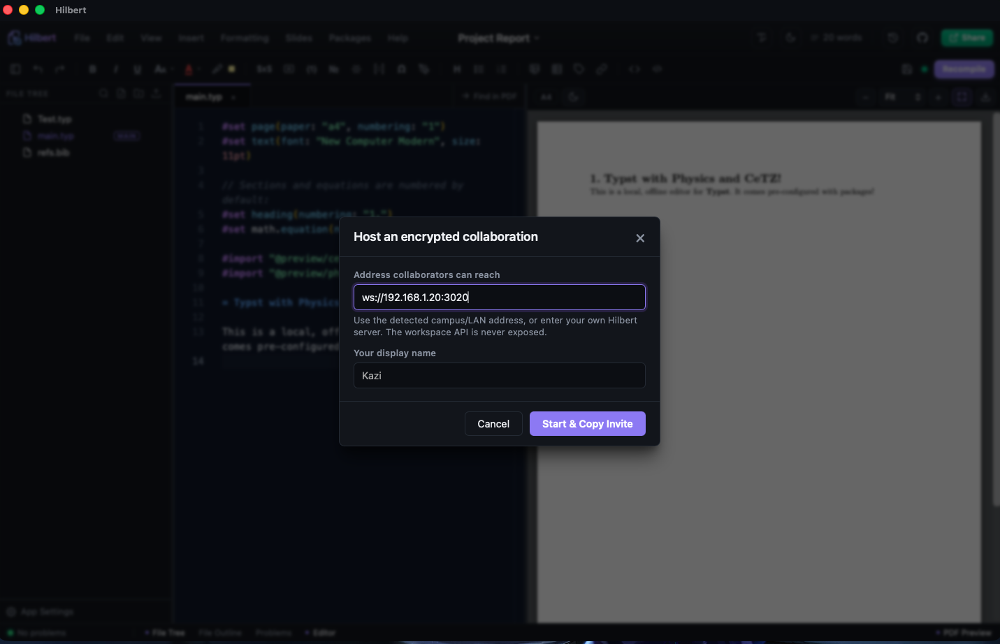
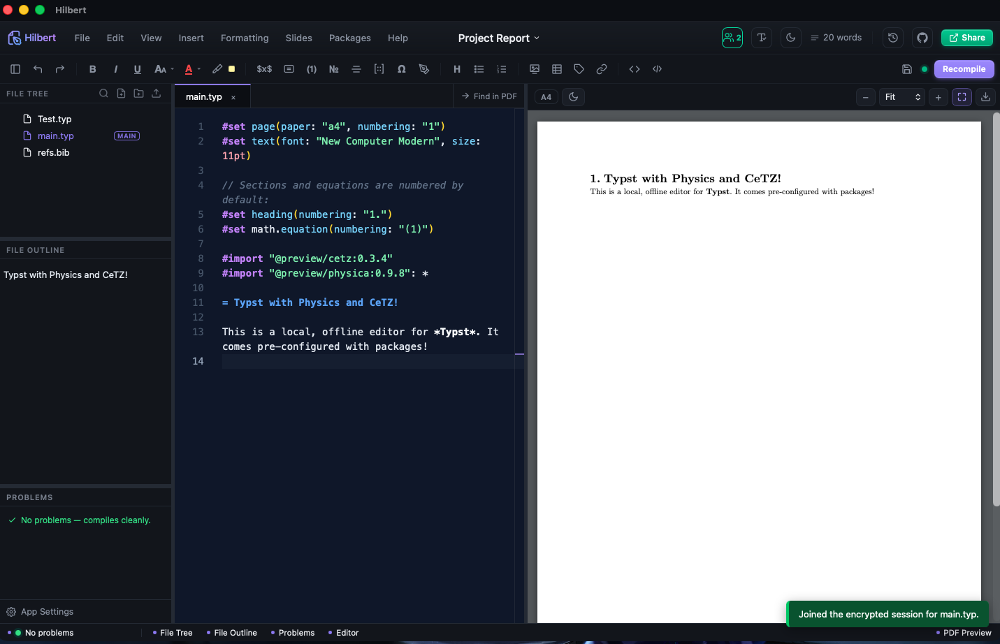

# Live collaboration

Hilbert lets two or more people edit the same file at the same time, the way Overleaf
does, but without an account and without a server that we run for you. The editing goes
peer to peer over a small relay. That relay can be one collaborator's own Hilbert (the
app opens a listener when it starts), or a machine you run yourself, like a spare server
or a Raspberry Pi.

Everything typed during a session is encrypted before it leaves your machine. The relay
only forwards the scrambled bytes and never sees your text. The key that unlocks it
rides inside the invitation you share, so treat an invitation like a password.

## What you need

- Hilbert running on each person's computer.
- A network path between the machines. On the same Wi-Fi that is automatic. Across a
  campus or the internet it needs one reachable address, which is covered below.
- A file open in the editor. A session shares the file that is currently open, not the
  whole project yet.

## Hosting a session

1. Open the file you want to share.
2. Open the command palette (Ctrl/Cmd+K) and pick "Host an encrypted live session", or
   click Share and switch to the Live tab.
3. Hilbert suggests an address other people can reach. On a home or hostel network this
   is usually your machine's LAN address, something like `ws://192.168.1.20:3020`.
   Accept it or type a different one.
4. Enter a display name so collaborators can tell whose cursor is whose.
5. Start the session. The invitation is copied to your clipboard. Send it to the people
   you want to edit with.



The invitation looks like this:

```
hilbert-collab://join?server=ws://192.168.1.20:3020&room=<random id>&key=<random key>
```

The room id and the key are generated fresh every time. Anyone holding the invitation
can join and read the file, so send it over a channel you trust.

## Joining a session

1. Open the command palette and pick "Join an encrypted live session", or click Share,
   go to the Live tab, and choose Join with invitation.
2. Paste the invitation.
3. Enter your display name.
4. Join. The shared file takes over the tab you had open, and from then on you and the
   host see each other's edits and cursors as they happen.



While a session is running, a small badge in the header shows how many people are
connected. Click it to leave. Leaving also clears your cursor from everyone else's
screen right away instead of leaving a ghost behind.

The host has to stay connected. The live document lives in the running editors, not on
the relay, so if the host closes Hilbert the others lose the shared copy. Everyone still
has their own file saved on disk, so no work is lost, but the live link ends. If you
want a session that outlives any one person, use a dedicated relay (see below).

## Network scenarios

### Everyone on one router

This is the easy case: a home, a lab, or a hostel room where every machine sits behind
the same Wi-Fi router. The host's LAN address, the `192.168.x.x` or `10.x.x.x` one that
Hilbert suggests, is reachable by everyone else on that router. Host, share the
invitation, join, done.

If the host machine has a firewall on, allow inbound TCP on the collaboration port
(3020 by default).

### Across a campus network

Some networks are not one router. On my campus each hostel room has its own ethernet
port, and people plug their own router into that port. Two people in different rooms are
then behind two different routers, and the `192.168.x.x` address one of them sees is
private to their own router. The other person has no way to reach it.

What does work is the address the campus network itself hands you, the one you would use
to `ssh` between machines across the campus. If you can `ssh` or `ping` from your
friend's machine to yours by some address, that same address works for collaboration.

Two ways to get there:

- Plug the host machine straight into the campus ethernet instead of going through a
  personal router, so it gets a campus address that other rooms can reach, then host on
  that address.
- Or run a relay on a machine that already has a campus-reachable address and have
  everyone point at it. That is the next section, and it is usually the cleaner option.

The rule of thumb is to pick an address the person joining can actually reach. If a
plain `ssh` to it works from their side, collaboration will too.

### A dedicated relay (a server or a Raspberry Pi)

Instead of one collaborator hosting, you can run a small relay on a machine that stays
on and is easy to reach, then point everyone at it. I use a Raspberry Pi on the campus
network for this, but any always-on box does the job, a home server or a rented one
included.

Run Hilbert in server mode on that machine:

```sh
hilbert --sync-server --port 3020
```

It prints the address to hand out. All it does is forward encrypted frames between
people in the same room. It has no workspace and no files, and it cannot read anything
anyone types.

Then set that address once in each person's Hilbert: command palette, "Set optional
collaboration server", and enter it, for example `ws://<relay address>:3020`. After
that, hosting uses the relay automatically, so whoever starts a session no longer has to
stay online for the rest. As long as the relay is up, the session stays alive.

A relay is also the faster setup, not just the more reliable one. Every edit already
travels through a relay in any session; the only choice is whose machine plays that
role. Put it on a well-placed box that both people reach over a short, direct route,
like a server on the campus network everyone is wired into, and the round trip is small.
That usually beats connecting through a slow overlay or across two home routers, where
the path wanders before it ever gets to the other person.

For a machine that should survive reboots, run the server under a process manager, either
systemd or a quick `tmux`/`screen` session, so it comes back on its own.

One thing about the Raspberry Pi and other non-Intel machines: the prebuilt Hilbert
downloads are for Intel and AMD computers. A Pi is ARM, so there is no ready-made binary
for it. You build it from source on the Pi instead, which the next section covers. The
build takes longer than running the relay does, but you only do it once.

If the relay sits on the public internet rather than a private campus network, put it
behind TLS and use a `wss://` address, or tunnel it, so the transport itself is
protected on top of the per-session encryption.

## Running from source

You need [Rust](https://www.rust-lang.org/tools/install) and
[Node.js](https://nodejs.org/). On Linux, including a Raspberry Pi, you also need the
system libraries that Tauri builds against. The current list lives on the
[Tauri prerequisites page](https://v2.tauri.app/start/prerequisites/); on Debian or
Raspberry Pi OS it is roughly:

```sh
sudo apt install libwebkit2gtk-4.1-dev build-essential curl wget file \
  libxdo-dev libssl-dev libayatana-appindicator3-dev librsvg2-dev
```

Then build and run:

```sh
git clone https://github.com/aburousan/hilbert-editor
cd hilbert-editor
npm install
npm run build
cd src-tauri
cargo run --release
```

The first build compiles a lot, so give it time. After that, the same binary runs the
normal app, and with the flag it runs as a relay instead:

```sh
cargo run --release -- --sync-server --port 3020
```

Once it is built you can also call the binary directly:

```sh
./target/release/typst-editor --sync-server --port 3020
```

## Good to know

- A session shares one open file, not the whole project. Switching to another file ends
  the session on your side.
- Saving, compiling, and export all keep working during a session. The file on disk is
  still yours.
- The collaboration listener starts on port 3020 when the app launches. Set
  `HILBERT_COLLAB_PORT` to move it. Set `HILBERT_COLLAB=0` to turn it off completely and
  keep Hilbert strictly local.
- That listener only ever carries the encrypted relay. It never exposes the file API,
  which stays bound to your own machine.
